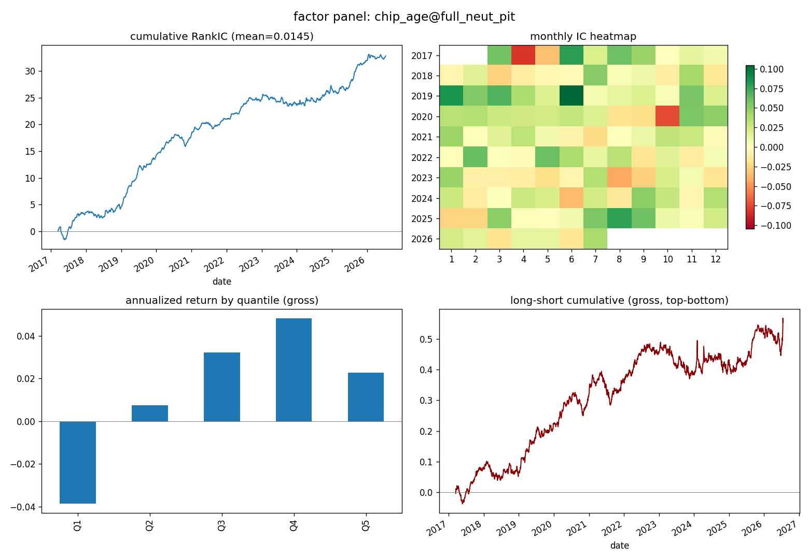

# Spencer 框架 — 从零自建的量化因子研究系统

*English version: [README_EN.md](README_EN.md)*

一套用**公开数据 + 公开方法论**从头搭建的日频因子研究全流程：
数据 → 因子 → 风格模型与中性化 → 三档评估面板 → 成本后回测 → 研究纪律。
目标不是"又一个回测库"，而是把一个量化研究系统必须回答的工程问题逐个
亲手回答一遍（见 `docs/量化研究系统必答30问.md`，这是本项目的真正主线）。

## 知识边界声明

本项目只使用三类来源，从第一行代码起就是干净的：

1. **公开数据**：baostock / akshare 免费行情接口；
2. **公开方法论**：qlib 的数据层设计思想、alphalens 的评估面板思想、
   MSCI Barra 公开白皮书的风格因子定义、AFML 的统计纪律（DSR/PBO/预注册）；
3. **原创工程**：目录结构、接口、命名、实现全部原创设计。

不包含任何机构的私有代码、表结构、字段名、参数常数。

## 架构

```
spencer/
  data/        数据层: 拉取(baostock, 含退市股PIT名单) → 宽表存储 | PIT宇宙构造器
  factor/      因子层: 注册表(带登记元信息) + 缓存指纹 + 末端断言 + 7因子 +
               入库验证契约(verify.admission_check 七关门禁)
  risk/        风险层: 自算六风格(五行情风格+BTOP PIT财报) + 行业哑变量 +
               残差化(因子/标签两侧) + 协方差 Σ=BFB'+diag(spec²)(EWMA, PIT记账)
  eval/        评估层: 六件套面板 + Newey-West t + 多horizon IC衰减曲线
  backtest/    回测层: 成本后分层 + 一字板可成交过滤(执行日对表) + 冲击项
  strategy/    策略层: 等权/ICIR合成 + 缓冲区top-N组合 + 目标持仓接口 +
               FISTA优化器(截断单纯形+风格暴露带, KKT/恒等式现场检验)
  model/       模型层: walk-forward GBM(已证伪结案, 见 output/falsify_model_gb.md)
  discipline/  纪律层: append-only台账 + DSR + PBO(CSCV), N 从台账直读
docs/          必答36问(活清单) | 工业级能力对照 | 吸收清单(概念级, 边界声明)
examples/      quickstart / fetch_pit / pit_final_run / optimizer_demo / falsify
tests/         12个测试文件65条断言全合成数据离线可跑(前视/PIT/正交性/成本单调/
               KKT), 含 DSR/PSR/PBO 与 alpha-court 独立实现的交叉对拍
```

## 快速开始（三步上手）

```bash
pip install -r requirements.txt
python tests/test_core.py                    # 1. 断言全绿(不碰网络)
python examples/quickstart.py --limit 80     # 2. 冒烟: 80只股票端到端
python examples/quickstart.py                # 3. 全量 a800(沪深300∪中证500)
python examples/fetch_pit.py                 # 4. 全市场PIT数据(含退市, ~40min, 断点续跑)
python examples/pit_final_run.py             # 5. 无幸存者偏差的正式口径终跑
python examples/opt_backtest_run.py          # 6. 优化器逐期回测(需先跑4/5)
```

严肃研究一律用步骤 4-6 的 PIT 口径；步骤 2-3 的快照宇宙只适合上手与冒烟
（幸存者偏差, 30问#6）。

产出：`output/` 下每因子×三档各一张面板图 + 逐年表，台账追加到
`research_ledger.csv`。

## 三档读数（本框架的核心用法）

同一因子跑三档，落差本身就是信息：

| 档 | 因子侧 | 标签侧 | 读的是什么 |
|---|---|---|---|
| @raw | 原始 | 原始收益 | 混合了风格搭便车的总预测力 |
| @size_neut | 剥市值 | 原始收益 | 去掉最大的一个便车 |
| @full_neut | 剥行业+五风格 | 同样剥行业+五风格 | 纯 alpha 读数 |

面板示例（chip_age 筹码龄因子 @full_neut，全市场 PIT 口径终跑）——
分层收益 Q4>Q5 的非单调没有被藏起来，面板的职责是如实呈现：



## 设计上的几条硬规矩（都有血泪出处，全部通识化）

- **前视偏差三道闸**：前瞻收益一律 `shift(-(1+h))/shift(-1)`；复权用后复权
  （前复权用今天的信息改写历史）；因子缓存双判据（源码+数据形状指纹 sidecar，
  外加"因子末端==数据末端"兜底）。
- **判因子看逐年一致性，不看裸均值**：单年驱动 = 假信号。面板强制输出逐年表。
- **对比必同口径**：同宇宙/窗口/中性化/末端；跨框架数字永不并排
  （见 `docs/与工业级框架的能力对照.md`）。
- **台账 append-only**：每次实验留痕，N 是多重检验校正（DSR/PBO）的输入。
- **成本假设写明**：净收益数字必须带口径，回答排序问题而非容量问题。

## 路线图

| 阶段 | 内容 | 状态 |
|---|---|---|
| M1 数据层 | baostock 日线、宽表存储、复权、a800/全市场(含退市) | ✅ |
| M2 因子层 | 注册 + 缓存指纹(源码哈希+数据形状) + 算子 + 7 因子 | ✅ |
| M3 评估层 | 六件套 + Newey-West t + 多 horizon IC 衰减曲线 | ✅ |
| M4 纪律层 | 台账+N计数 + DSR + PBO(CSCV) + 预注册工单(判据冻结防篡改) + 噪声对照(保形状置换检验) | ✅ |
| M5 回测层 | 成本后分层 + 一字板可成交过滤(执行日对表) + 冲击项 | ✅(研究级) |
| M6 风格模型 | 六风格 + 行业 + 标签残差化 + 协方差 Σ=BFB'+spec²(PIT记账) | ✅ |
| M7 宇宙PIT | 构造器 + 全市场5791只含退市数据 + 终跑落地 | ✅ |
| M8 模型层 | walk-forward GBM + **证伪三连结案**(output/falsify_model_gb.md) | ✅(已结案) |
| M9 策略层 | 合成 + 缓冲组合 + 目标持仓接口 + 优化器×风险模型真数据闭环 | ✅ |
| M10 入库门禁 | 验证契约七关(verify) + 因子登记元信息(valid_from联动) | ✅ |

**设计边界（不做，明示）**：撮合级回测与容量模型（日频数据的天花板）、
行业分类历史时点化（无公开数据源）、实时行情与下单（执行端租平台）。
