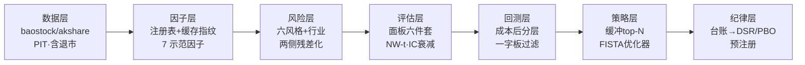

# Spencer 框架 — 从零自建的量化因子研究系统

> 一套只用**公开数据 + 公开方法论**、从第一行代码搭起的日频因子研究全流程。
> 它回答的不是"这个因子历史上赚不赚钱"，而是"剥掉风格搭便车、扣掉成本、
> 做完多重检验缩水之后，**这个结果还该不该信**"。

[](LICENSE)
[](requirements.txt)
[](tests/)
[-orange.svg)](spencer/data/)
[](spencer/data/universe.py)

*English version: [README_EN.md](README_EN.md) · 详细说明书: [docs/使用指南.md](docs/使用指南.md)*

## ✨ 它能做什么

- **无幸存者偏差的数据层**：全市场含退市股的 PIT 宇宙构造器（新股预热 / 剔 ST /
  流动性截面），财报数值按披露日而非报告期生效；
- **带缓存指纹的因子层**：`@factor` 一行注册；缓存按"函数源码 + 数据形状"双指纹
  自动失效，改代码换数据永不吃到脏缓存；
- **三档中性化读数**：同一因子在 @raw / @size_neut / @full_neut 三档下的 IC 阶梯，
  直接量出有多少收益是风格搭便车（自算六风格 + 行业，因子/标签两侧残差化）；
- **两套显著性口径**：保守缩水 t（下界安全垫）+ Newey-West t（Bartlett 核，
  lag=horizon），重叠窗口的自相关不再虚高显著性；
- **成本后回测**：一字板可成交过滤按**执行日**对表（不是信号日），费率地板与
  冲击预算分开报数，每条口径假设写在模块 docstring 里；
- **组合层白盒优化器**：FISTA + 截断单纯形投影 + 风格暴露带，KKT 残差与 λ→∞
  恒等式现场检验；
- **研究纪律做进系统**：append-only 实验台账 → 试验数 N 直灌 DSR / PBO(CSCV)
  多重检验；预注册工单先冻结判据再跑计算；
- **证伪是功能不是事故**：一个 rank IC 0.048、九年全正的"好到可疑" ML 因子，
  被三个证伪实验解剖结案（[完整报告](output/falsify_model_gb.md)）——系统的
  设计目标就是能亲手杀死自己的最好结果。

## 🔏 知识边界声明

本项目只使用三类来源，从第一行代码起就是干净的：

1. **公开数据**：baostock / akshare 免费行情接口；
2. **公开方法论**：qlib 的数据层设计思想、alphalens 的评估面板思想、MSCI Barra
   公开白皮书的风格因子定义、AFML 的统计纪律（DSR/PBO/预注册）；
3. **原创工程**：目录结构、接口、命名、实现全部原创设计。

不包含任何机构的私有代码、表结构、字段名、参数常数。

## 🗺️ 系统全景



## 📈 面板长什么样

chip_age（筹码龄）@full_neut，全市场 PIT 口径终跑——分层收益 Q4>Q5 的
非单调**没有被藏起来**，面板的职责是如实呈现：


它的逐年一致性表（同一次终跑的真实产出，判因子首要看这张不看裸均值）：

| 年份 | 2017 | 2018 | 2019 | 2020 | 2021 | 2022 | 2023 | 2024 | 2025 | 2026 |
|---|---|---|---|---|---|---|---|---|---|---|
| IC 均值 | +.018 | +.004 | +.040 | +.017 | +.011 | +.015 | **−.004** | +.013 | +.022 | +.007 |

十年 9 正 1 负，2023 如实为负——这行负数就是这套系统存在的理由。

## 🔬 终跑结果（全市场 PIT 宇宙 5791 只 × 10.5 年，成本后）

完整数字见 [output/PIT终跑报告.md](output/PIT终跑报告.md)（与本仓库一同发布），
这里放几个能说明系统在干活的读数。

**三档读数当场扒掉"伪因子"**——@raw 档看着个个都行，剥完风格见真章：

| 因子 | @raw IC（保守t） | @full_neut IC | 判决 |
|---|---|---|---|
| amihud_20 流动性 | 0.059（7.3） | **0.001（t=0.3）** | 收益全是风格搭便车 |
| vol_20 波动率 | 0.085（8.6） | 0.009（多空净为负） | 同上 |
| chip_age 筹码龄 | 0.084（7.6） | **0.015（NW-t 5.8）** | 中性化后仍然活着 |
| rev_5 短反转 | 0.016（2.1） | **0.029（NW-t 8.5）** | 唯一越剥越强的 |

**合成与组合**（一字板过滤 + 成本后）：等权合成 IC 0.026 / NW-t 6.0，多空净年化
8.2%（sharpe 0.75）；top50/缓冲80 多头超额 +5.4%（sharpe 0.6）对宇宙等权基准，
年化单边换手 15.4x。

**优化器实验**（commit 历史 v1.2 / v1.4 记录，`examples/opt_backtest_run.py` 复跑）：
把成本 τ 写进目标函数 vs 事后扣费的同门对照——换手 5.1x → 1.2x，净超额
0.65% → 1.46%；τ 扫描的净超额峰值恰好落在真实成本率 15bp 处。

**然后统计纪律对最好的数字动刀**：台账 N=60 校正后 **DSR 0.466——不显著**；
7 因子多空矩阵 PBO(CSCV) φ=0.067。上面所有好看的数字，配上这一行才完整——
**这一行就是本系统的产品**。

## 🚀 快速开始

```bash
pip install -r requirements.txt
python tests/test_core.py                    # 0. 断言全绿(全部离线, 不碰网络)
python examples/quickstart.py --limit 80     # 1. 冒烟: 80只股票端到端 ~几分钟
python examples/quickstart.py                # 2. 全量 a800(沪深300∪中证500)
```

每个因子跑完，终端打印 IC 均值 / 日频 ICIR / 两套 t 值 / 逐年一致性，
`output/` 落面板图与逐年表，台账追加到 `research_ledger.csv`。

严肃研究一律用 PIT 口径三部曲（快照宇宙有幸存者偏差，只配冒烟）：

```bash
python examples/fetch_pit.py          # 3. 全市场PIT数据(含退市, ~40min, 断点续跑)
python examples/pit_final_run.py      # 4. 无幸存者偏差的正式口径终跑
python examples/opt_backtest_run.py   # 5. 优化器逐期回测(τ成本前置 vs 事后扣费双臂)
```

**每个入口做什么、参数怎么调、面板怎么读、如何注册自己的因子 →
[docs/使用指南.md](docs/使用指南.md)**

## 📐 三档读数（本框架的核心用法）

同一因子跑三档，落差本身就是信息：

| 档 | 因子侧 | 标签侧 | 读的是什么 |
|---|---|---|---|
| @raw | 原始 | 原始收益 | 混合了风格搭便车的总预测力 |
| @size_neut | 剥市值 | 原始收益 | 去掉最大的一个便车 |
| @full_neut | 剥行业+五风格 | 同样剥行业+五风格 | 纯 alpha 读数 |

## 🧱 设计上的几条硬规矩（都有血泪出处，全部通识化）

- **前视偏差三道闸**：前瞻收益一律 `shift(-(1+h))/shift(-1)`；复权用后复权
  （前复权用今天的信息改写历史）；因子缓存双判据外加"因子末端==数据末端"兜底。
- **判因子看逐年一致性，不看裸均值**：单年驱动 = 假信号。面板强制输出逐年表。
- **对比必同口径**：同宇宙/窗口/中性化/末端；跨框架数字永不并排
  （见 `docs/与工业级框架的能力对照.md`）。
- **台账 append-only**：每次实验留痕，N 是多重检验校正（DSR/PBO）的输入。
  本框架当前最好的合成读数是 **DSR 0.47（N=60 下不显著）**，README 就这么写
  ——系统的职责是让它自己说出这句话。
- **成本假设写明**：净收益数字必须带口径，回答排序问题而非容量问题。

## 🧭 仓库导览（每个文件都有明确职责）

```
spencer/
  data/        拉取(含退市股PIT名单) → 宽表存储 | PIT宇宙构造器
  factor/      注册表(带登记元信息) + 缓存指纹 + 末端断言 + 7因子 + 入库验证七关
  risk/        自算六风格(五行情+BTOP PIT财报) + 行业哑变量 + 残差化 + 协方差 Σ=BFB'+diag(spec²)
  eval/        六件套面板 + Newey-West t + 多horizon IC衰减曲线
  backtest/    成本后分层 + 一字板可成交过滤(执行日对表) + 冲击项
  strategy/    等权/ICIR合成 + 缓冲top-N + 目标持仓接口 + FISTA优化器(KKT现场检验)
  model/       walk-forward GBM(已证伪结案, 见 output/falsify_model_gb.md)
  discipline/  append-only台账 + DSR + PBO(CSCV) + 预注册(判据冻结)
tests/         12个测试文件65条断言, 全合成数据离线可跑(前视/PIT/正交性/成本单调/KKT),
               含 DSR/PSR/PBO 与 alpha-court 独立实现的交叉对拍
examples/      入口: quickstart / fetch_pit / pit_final_run / opt_backtest_run
               研究轮次驱动(即研究叙事的收据): night_run / rebal_sweep / round3 / round4
               证伪与演示: falsify_model_gb / optimizer_demo | 公共装配层: _pit_common
docs/          使用指南 | 必答30问(主线) | 工业级能力对照 | 与alpha-court交叉验证 | 吸收清单
tickets/       预注册工单实例(.json 判据 + .sha256 冻结校验)
output/        入库的两份报告: 证伪结案 + PIT终跑(其余运行产物不入库)
config.yaml    单一真相源配置 —— 所有模块只从这里读参数
```

## 📚 文档地图

| 文档 | 内容 |
|---|---|
| [使用指南](docs/使用指南.md) | 说明书：入口/产出/参数/面板判读/自定义因子/多重检验报数 |
| [必答30问](docs/量化研究系统必答30问.md) | **本项目的真正主线**：每一问附"不回答会怎么死"与本项目的回答或欠账 |
| [工业级能力对照](docs/与工业级框架的能力对照.md) | 与 qlib / alphalens 逐能力对照，以及为什么不并排比数字 |
| [交叉验证](docs/交叉验证-court.md) | DSR/PSR/PBO 与 alpha-court 独立实现的对拍记录 |
| [证伪结案报告](output/falsify_model_gb.md) | 一个"好到可疑"的 ML 因子被三个实验解剖的全过程 |
| [PIT 终跑报告](output/PIT终跑报告.md) | 全市场 PIT 口径的完整终版读数：7 因子三档全表 + 合成组合 + DSR/PBO 统计出口 |

## 🛣️ 路线图

| 阶段 | 内容 | 状态 |
|---|---|---|
| M1 数据层 | baostock 日线、宽表存储、复权、a800/全市场(含退市) | ✅ |
| M2 因子层 | 注册 + 缓存指纹(源码哈希+数据形状) + 算子 + 7 因子 | ✅ |
| M3 评估层 | 六件套 + Newey-West t + 多 horizon IC 衰减曲线 | ✅ |
| M4 纪律层 | 台账+N计数 + DSR + PBO(CSCV) + 预注册工单(判据冻结防篡改) + 噪声对照(保形状置换检验) | ✅ |
| M5 回测层 | 成本后分层 + 一字板可成交过滤(执行日对表) + 冲击项 | ✅(研究级) |
| M6 风格模型 | 六风格 + 行业 + 标签残差化 + 协方差 Σ=BFB'+spec²(PIT记账) | ✅ |
| M7 宇宙PIT | 构造器 + 全市场5791只含退市数据 + 终跑落地 | ✅ |
| M8 模型层 | walk-forward GBM + **证伪三连结案**(output/falsify_model_gb.md) | ✅(已结案) |
| M9 策略层 | 合成 + 缓冲组合 + 目标持仓接口 + 优化器×风险模型真数据闭环 | ✅ |
| M10 入库门禁 | 验证契约七关(verify) + 因子登记元信息(valid_from联动) | ✅ |

## 🚧 设计边界（不做，明示）

撮合级回测与容量模型（日频数据的天花板）、行业分类历史时点化（无公开数据源）、
实时行情与下单（执行端租平台——本仓库输出目标持仓）。

## License

MIT © 2026 Spencer
