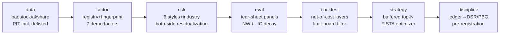

# Spencer Framework — a daily-frequency equity factor research system, built from scratch

> Built exclusively on **public data + public methodology**. It answers not
> "did this factor make money in a backtest" but "after stripping style
> free-riding, charging costs, and deflating for multiple testing — **should
> you believe the result at all**."

[](LICENSE)
[](requirements.txt)
[](tests/)
[-orange.svg)](spencer/data/)
[](spencer/data/universe.py)

*中文版（更详细）: [README.md](README.md) · Detailed manual: [docs/使用指南.md](docs/使用指南.md) (Chinese)*

## ✨ Features

- **Survivorship-free data layer**: point-in-time universe with delisted names;
  fundamentals effective the day *after* disclosure, never the report date;
- **Fingerprinted factor registry**: one-decorator registration; caches
  invalidate on a source-code + data-shape double fingerprint;
- **Three-tier neutralization readings**: every factor read raw /
  size-neutral / industry+6-style-neutral (factor *and* label residualized) —
  the gap between tiers measures style free-riding;
- **Two significance conventions**: a conservative n/horizon-shrunk t as the
  lower-bound cushion, plus Newey-West (Bartlett kernel, lag = horizon);
- **Cost-aware backtest**: limit-board tradability filtered on the *execution*
  day; fee floor and impact budget reported separately, every assumption
  written down in the module docstring;
- **White-box optimizer**: FISTA + capped-simplex projection with style
  exposure bands; KKT residuals and a λ→∞ identity check run on every demo;
- **Discipline built in**: append-only experiment ledger feeds the trial
  count N straight into Deflated Sharpe and PBO (CSCV); pre-registration
  tickets freeze criteria before computation;
- **Falsification as a feature**: a too-good-to-be-true ML factor (rank IC
  0.048, nine years all-positive) was dissected by three falsification
  experiments and closed — full post-mortem in
  [output/falsify_model_gb.md](output/falsify_model_gb.md).

## 🗺️ Architecture



## 📈 Sample tear sheet

`chip_age` @full_neut, survivorship-bias-free PIT run — note the panel does
*not* hide the Q4>Q5 non-monotonicity, and the yearly table honestly shows
2023 negative (9 of 10 years positive):


## 🚀 Quickstart

```bash
pip install -r requirements.txt
python tests/test_core.py                 # offline sanity (all tests are offline)
python examples/quickstart.py --limit 80  # end-to-end smoke on 80 names
python examples/quickstart.py             # full CSI300+CSI500 universe
python examples/fetch_pit.py              # full-market PIT data (incl. delisted)
python examples/pit_final_run.py          # survivorship-bias-free full run
python examples/opt_backtest_run.py       # optimizer backtest (cost-in-objective vs ex-post)
```

Detailed manual — what each entry point does, how to read the panels, how to
register your own factor: [docs/使用指南.md](docs/使用指南.md) (Chinese).

## 🔏 Provenance statement

Three sources only, clean from the first line: **public data** (baostock /
akshare free APIs), **public methodology** (qlib's data-layer design,
alphalens-style tear sheets, MSCI Barra's published style-factor definitions,
Newey-West 1987, Deflated Sharpe & PBO by Bailey & López de Prado, FISTA by
Beck & Teboulle), and **original engineering** (every interface, name, and
implementation). No proprietary code, schemas, or constants from any
institution.

The system's best composite currently reads **DSR 0.47 — i.e. not significant
after N=60 ledger-counted trials — and it says so itself.** That sentence is
the design goal.

## 🚧 Honest limitations (by design)

Match-level execution simulation and capacity modelling (beyond daily data),
historical industry membership (no public source), live trading (rent a
broker platform — this repo outputs target holdings).

## License

MIT © 2026 Binshan "Spencer" Si
